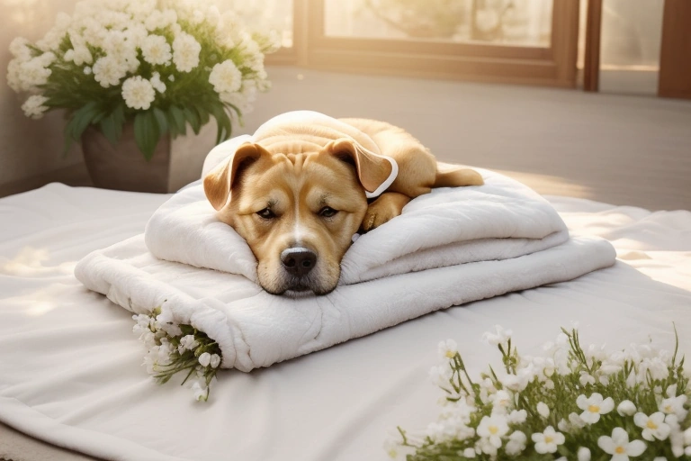

# 北京宠物火化服务 | 专业温暖的告别仪式

<MyContact />

### 每一个毛孩子，都值得被温柔以待

当陪伴多年的爱宠离开，心里的空缺难以填补。它曾是你的家人、你的朋友，在无数个日夜里给予你温暖和陪伴。现在，是时候用一场体面的告别，送它最后一程。

### 服务流程：让告别变得简单而庄重

- **预约咨询**：24小时热线，随时响应您的需求
- **专车接运**：北京市区及周边，2小时内上门接运
- **告别仪式**：独立告别室，留出充足时间与爱宠独处
- **独立火化**：一宠一炉，可全程观看，确保骨灰纯净
- **骨灰交付**：精美骨灰罐，永久保存这份纪念

### 北京本地服务覆盖

我们的服务覆盖北京全境16个区：
- 城六区：东城、西城、朝阳、海淀、丰台、石景山
- 近郊区：通州、大兴、顺义、昌平、房山、门头沟
- 远郊区：怀柔、密云、平谷、延庆

无论您在北京的哪个角落，我们都能在最短时间内赶到。

### 温馨提示

1. **提前预约**：建议提前半天预约，确保服务时间
2. **保留纪念品**：可以保留爱宠的毛发、爪印作为纪念
3. **选择正规服务**：确认服务方有资质、有实体店、可实地考察
4. **了解流程**：清楚每一个环节，让告别更有仪式感

### 常见问题

**Q：宠物火化需要多长时间？**
A：根据宠物体型，一般1-3小时不等，我们会确保充分火化，保证骨灰完整。

**Q：可以全程观看吗？**
A：可以。我们提供透明化服务，您可以全程陪伴，确保安心。

**Q：骨灰怎么处理？**
A：可以带回家安放，也可以选择我们的骨灰寄存服务，或制作成纪念品（如骨灰钻石、项链等）。

**Q：服务费用大概多少？**
A：根据宠物体型和服务内容不同，费用会有差异。具体可联系客服咨询，我们会给出详细报价。

**Q：需要准备什么？**
A：您只需要准备爱宠生前喜欢的玩具或食物作为告别礼物，其他我们都为您准备好了。

<MyContact />